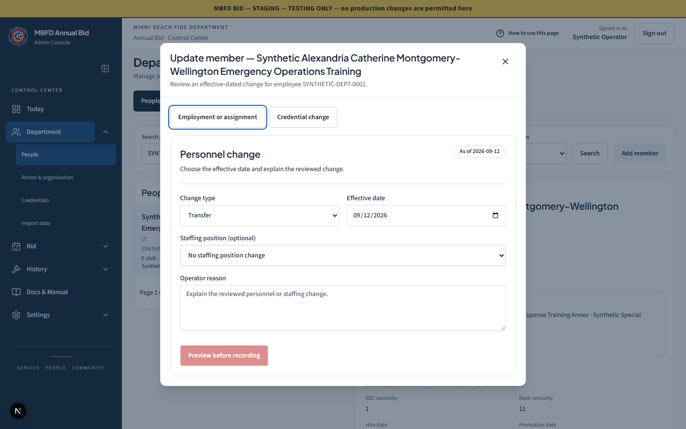
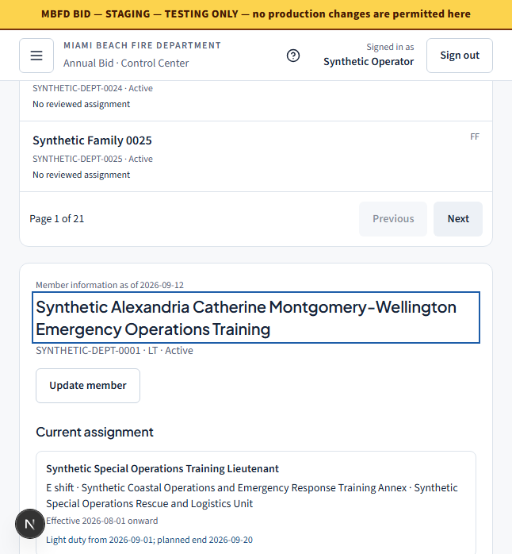
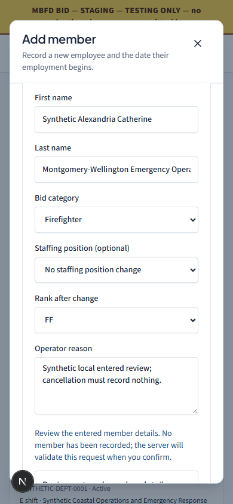

# Department browser validation

On September 12, 2026, **18 Department browser cases and 14 existing Today/navigation
cases passed across recorded runs** against the local candidate. This is browser
evidence for the [Department workspace](department-workspace.md), separate from
unit tests, hosted CI and production acceptance.

## Recorded runs

| Run | Result | Interpretation |
| --- | --- | --- |
| Existing Today/navigation suite | 12 passed, 2 failed in 1.8 minutes | The Bid-board test needed the delivered Bid navigation label and a wait for completed navigation. The Guide test needed to select the matching topic in the delivered guide. |
| Final acceptance run | 20 passed in 1.3 minutes | All 18 Department cases and the two updated regression cases passed. |

The passing coverage totals 32 cases. **No single 32-case command was run.**
The other 12 regression cases were already passing and were not repeated in
the final command. The final run's local `.last-run.json` recorded
`status: passed` with no failed tests.

The 14 existing cases comprise six in
[`today-staffing.spec.ts`](../../apps/web/tests/e2e/today-staffing.spec.ts),
four in [`admin-layout.spec.ts`](../../apps/web/tests/e2e/admin-layout.spec.ts),
three in [`design-system-modernization.spec.ts`](../../apps/web/tests/e2e/design-system-modernization.spec.ts),
and one in [`admin-bid-board.spec.ts`](../../apps/web/tests/e2e/admin-bid-board.spec.ts).
The two no-JWT cases that navigate to external staging Hub login were excluded
from this local fixture run.

Scoped TypeScript validation of the promoted Department fixtures/spec, Biome
checks for the five changed E2E files, and `git diff --check` also passed.

The release coordinator reported these additional final local checks after
browser QA. They are separate from the browser-case totals above:

| Check | Reported result |
| --- | --- |
| `pnpm lint` | Passed across 921 files |
| Full `pnpm typecheck` | Passed |
| Fresh full Web test run | 88 files passed; 378 tests passed |
| Worker test run | 208 files passed, 1 skipped; 1,306 tests passed, 2 skipped |
| Durable Object tests | 2 files passed; 3 tests passed |
| Next production build | Passed |

## Department coverage

The [Department spec](../../apps/web/tests/e2e/department-people.spec.ts) contains
the following 18 cases:

| Cases | Checked behavior |
| --- | --- |
| 3 | All 517 distinct members are reached exactly once through pages of 25 at 1440 × 900, 646 × 698 and 390 × 844. Search reaches member 517 and the first/end pager states are correct. |
| 1 | An off-page `memberId` deep link survives reload. Date changes request a new server projection, and recorded future employment history remains inspectable. |
| 1 | Duplicate human names preserve distinct employee IDs; employment-status filters and empty results behave correctly. |
| 1 | Update member opens and cancels without issuing a mutation. |
| 2 | At both mobile widths, a deep-linked member heading receives focus and is inside the visible viewport. |
| 3 | Add member presents an entered-data review, preserves work through Keep editing, and discards with focus returned to its trigger at all three widths. No member is recorded. |
| 1 | Switching Update member branches requires an explicit decision about dirty form contents. |
| 1 | Pending list/detail requests show loading, and a previous member is not displayed as the newly selected identity. |
| 1 | Failed list and member-detail reads recover through their Retry buttons. |
| 1 | Failed credential definitions recover through the Retry button. |
| 3 | Canonical Roster, Organization, Credentials, TeleStaff and TargetSolutions views render at all three widths. Department credential point controls are absent. |

The Today regression additionally checks desktop main/roster fit, complete
explicit paging, dynamic shifts, long records and reachable record details.

## Fixture isolation and fixes verified

The [synthetic fixture](../../apps/web/tests/e2e/department-people-fixtures.ts)
uses exported shared Department types and explicit presentation snapshots.
It does not implement personnel or eligibility policy. The 517 identities,
assignments, credentials and recorded events are synthetic.

The browser used an explicitly synthetic administrator JWT, a local Next
development server on port 3000, and the local API helper on port 31987.
Fixture routing rejects non-loopback requests, business writes and unknown API
reads. Tests assert no page exceptions or React console errors. The blocked
Next development stack-frame diagnostic request is not classified as a business
mutation. TeleStaff screenshot capture waits for its initial client request so
Playwright does not change caret styles during hydration.

Two product defects were found and their fixes were verified:

- Mobile member headings received focus outside the viewport. Allowing the
  focus operation to scroll brought the heading into view at 646 and 390 pixels.
- The roster's absolutely positioned accessibility label escaped the table
  scroller, increasing document width by 144 pixels at 646 and 392 pixels at 390.
  Positioning that scroller relatively contained the label while preserving
  all table content.

Both local server processes were stopped after validation, and ports 3000 and
31987 were verified free. No deployment, commit or production mutation was
performed for this browser evidence.

## Representative reviewed captures

These are unmodified copies of screenshots already inspected in the passing
acceptance run. Every visible identity and record is synthetic.

### Desktop Update member — 1440 × 900

The long member identity wraps in the task panel, with the Department workspace
retained behind it.



### Focused mobile member — 646 × 698

The deep-linked member heading is visibly focused after the browser scrolls to
the inline detail region.



### Add member entered review — 390 × 844

The panel body scrolls beneath its reachable Close control. The visible notice
distinguishes review of entered details from recording a member; further review
content remains reachable below this captured scroll position.



## Reproduction and limits

With the isolated local servers and synthetic `JWT_SIGNING_KEY` configured,
set `E2E_TEST_API_BASE=http://127.0.0.1:31987` and run from `apps/web`:

```powershell
pnpm exec playwright test tests/e2e/today-staffing.spec.ts tests/e2e/admin-bid-board.spec.ts tests/e2e/admin-layout.spec.ts tests/e2e/design-system-modernization.spec.ts --project desktop --workers 1 --grep-invert 'Admin gate — no JWT' --output ../../tmp/unified-platform/department-navigation-regression --reporter line

pnpm exec playwright test tests/e2e/department-people.spec.ts tests/e2e/admin-bid-board.spec.ts tests/e2e/admin-layout.spec.ts --project desktop --workers 1 --grep 'department-people.spec.ts|independent board|searchable Administrator Guide' --output ../../tmp/unified-platform/department-browser-acceptance --reporter line
```

The complete local report, 43 screenshots and screenshot index remain under
`tmp/unified-platform/department-browser-acceptance/`. Earlier failure geometry
is retained under `tmp/unified-platform/department-browser-route-diagnostics/`.
Those local artifacts are ignored; the representative copies above are retained
with this document.

Department pages fit the document width at the tested sizes. The roster table
retains contained horizontal scrolling at narrow widths, and long forms/details
use their normal vertical scrolling. Screenshots show a captured viewport or
scroll position, not every field simultaneously.

This validates Chromium keyboard focus, accessible names and synthetic browser
behavior. It does not establish NVDA spoken output, physical-device behavior,
representative real-user acceptance, deployed SHA/runtime identity, real data
correctness or a successful production mutation. No successful personnel or
qualification mutation fixture was invented; writer and receipt behavior is
covered separately by the existing contract tests.
