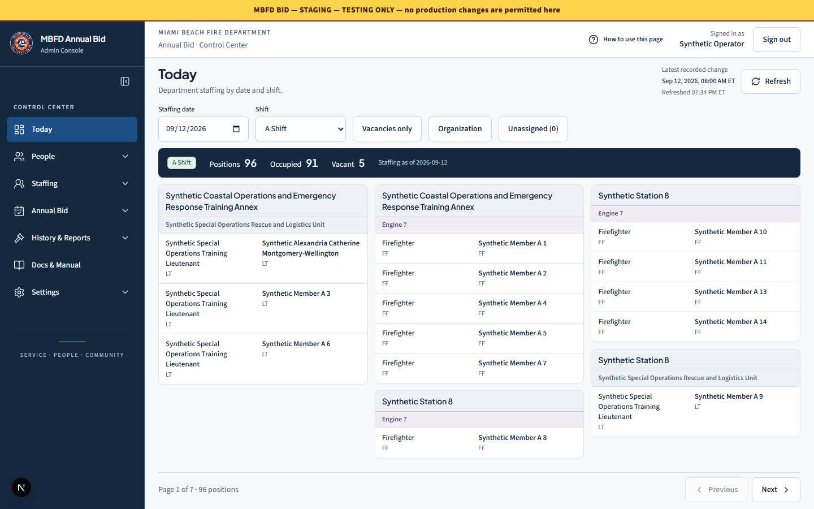
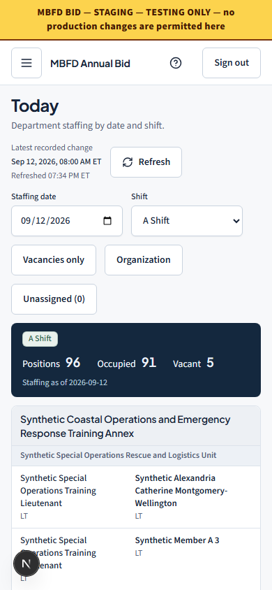

# Department projection and Today validation

Candidate scope: the first Department read-model and Today slices in the [implementation contract](implementation-contract.md). The remaining Department editing, Bid versioning, Blueprint and retirement work is not represented as delivered by this candidate.

## Behavior and source boundaries

`GET /api/admin/department/current-roster` requires the existing administrator authorization and returns effective-dated staffing without annual policy queries. The legacy roster endpoint retains its Bid participation adapter. Organization identities and dated relationships drive location labels when explicitly linked; unlinked source labels remain available. Personnel rank/status uses the existing lifecycle evaluator, including its before-first-event behavior.

Today renders real projection data, preserves readable labels and measures available desktop space. Explicit pages preserve every position. Unusually tall temporary-assignment context opens in a keyboard-accessible detail panel after wider columns have been attempted. Mobile uses ordinary page scrolling. Counts, missing data and refresh failures are explicit.

`updatedAt` means the latest recorded source change, with per-row seconds/milliseconds normalization for the existing mixed member column. Temporary-overlay end operations currently have no recorded update timestamp. The separate Refreshed time records the actual successful fetch; it does not invent missing source provenance.

## Local validation recorded 2026-09-12

| Check | Result |
| --- | --- |
| Frozen install, internal package builds | Passed using Node 22.22.3 and pnpm 9.12.0 |
| Repository Biome and full typecheck | Passed; temporary spike/draft files are excluded from the repository lint scope |
| Worker main suite | 205 passed files, 1 skipped; 1,276 passed tests, 2 skipped, with `--maxWorkers=2` |
| Local Wrangler integration launchers | 5 files / 25 tests passed with the original five-second assertion timeout |
| Durable Object runtime recovery | 2 files / 3 tests passed in the actual local Workers runtime |
| Web unit/component suite | 83 files / 327 tests passed |
| Shared schemas | 166 passed tests |
| Eligibility package | 95 passed tests, 1 skipped |
| A-Day package | 69 passed tests |
| Engine coverage | Eligibility and A-Day each report 100% statements, branches, functions and lines in their configured coverage scopes |
| Department/legacy/organization/timestamp plus current Bid characterization | 43 passed tests, including 129–160-character organization-name filtering through both adapters |
| Guide/manual/refresh focused checks | 11 passed tests |
| Today browser suite | 6 passed tests; 1857×970, 1440×900, 646×698, 390×844; complete record reachability, desktop main/roster fit, dynamic E shift, empty organization units, extreme labels and 40-overlay detail with focus return |
| Today/navigation browser regression | 14 passed tests including the legacy board, role gates, manual search, mobile navigation, Live override cancellation/focus, touch targets and reduced motion; fixture-only local APIs |
| Standard production build | Passed; Next 15.5.24, Today route 8.49 kB / first load 154 kB |
| Migration/deployment/backup guards | Staging and production workflow guard scripts and private backup preflight test script passed |
| Administrator manual | Regenerated from guide content; 44 topics, 50 pages; changed Today page visually rendered and inspected |

The first fully parallel Worker run timed out while comparing a serialized fixture database with Vitest's recursive equality matcher. The test now uses exact native buffer equality and passed in the bounded full suite. An earlier Wrangler run had three five-second cold-start/response timeouts during concurrent build/test activity; its unchanged assertions passed when rerun without that load. Neither failure was hidden by skipping tests or increasing timeouts.

Independent review found that roster filters rejected organization names longer than 128 characters while the catalog permits 160. Two regression cases failed before the correction and pass through Department and legacy APIs after aligning those bounds.

Current Bid characterization pins the executable configuration and committed seed behavior. Synthetic fixtures and executable regression parity are **not** represented as an approved normative policy replay or production acceptance. The repository's private historical golden replay remains separately gated.

The native Windows OpenNext attempt compiled Next successfully but failed at Sharp `.node` packaging. This is a failed local packaging gate. A hash-verified Linux candidate build is required separately before release.

## Browser review captures

These captures use deliberately synthetic local fixtures; their names and counts are not production data. The desktop capture shows explicit paging. The phone capture shows the initial portion of the normally scrolling roster.

## Release evidence boundaries

This candidate introduces no database migration. The worktree uses the exact recorded main base in the implementation contract, preserves the original shared checkout, and contains no production test data or private credentials. Hosted CI, CodeQL, exact release identity and live browser acceptance must be recorded for the committed candidate separately. A responding health endpoint is not source-SHA evidence.

No Real Bid was started or advanced. No historical Mock or completed Live evidence was changed. No production personnel or policy was altered for testing. Portal writeback remains disabled.
